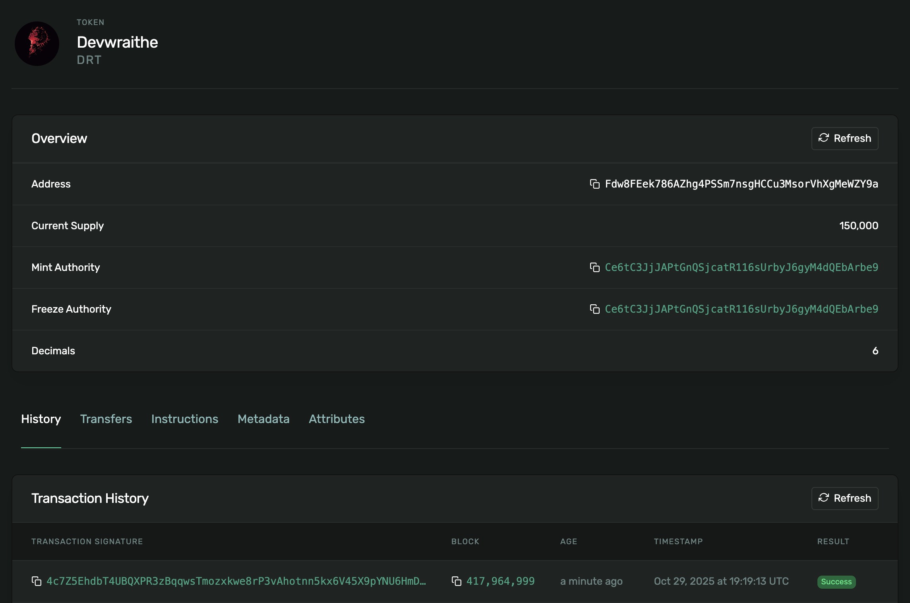

# Moneta

**Create and mint SPL tokens on Solana.**

Moneta is a simple toolkit for creating SPL tokens on Solana Devnet. Named after the Roman goddess of money and mints, it provides three core functions: create a token mint, add metadata, and mint tokens.

## Mint Token Details

**Token Address:** `Fdw8FEek786AZhg4PSSm7nsgHCCu3MsorVhXgMeWZY9a`



[View on Solana Explorer](https://explorer.solana.com/address/Fdw8FEek786AZhg4PSSm7nsgHCCu3MsorVhXgMeWZY9a?cluster=devnet)

## Setup

```bash
git clone https://github.com/devwraithe/moneta.git
cd moneta
yarn install
```

## Usage

**Create a mint**

```bash
yarn create-mint
```

**Add metadata**

```bash
yarn add-metadata
```

**Mint tokens**

```bash
yarn mint-tokens
```

## Security

⚠️ **Never commit your `mint_authority.json` file or share your private keys.**

---

_In cryptography we trust, in Moneta we forge._
